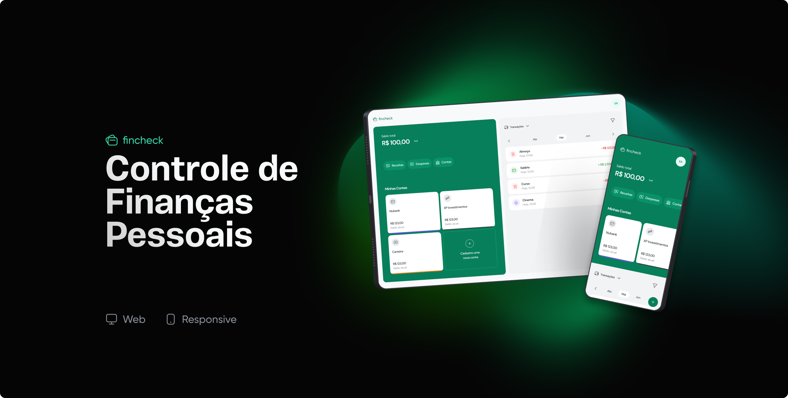

**Fincheck** is a web app that help the users to track their financial life.

This was build during the JStack course and the reason behind doing this project was to improve my backend knowledge on NestJS and build a beautifull interface with React.

# :computer: Technologies

## Front-end

-   [TypeScript](https://www.typescriptlang.org/)
-   [Vite](https://vitejs.dev/)
-   [Tailwind CSS](https://tailwindcss.com/)
-   [Radix UI](https://www.radix-ui.com/)
-   [Headless UI](https://headlessui.com/)
-   [React Query](https://tanstack.com/query/latest/)

## Back-end

-   [Docker](https://www.docker.com/)
-   [NestJS](https://nestjs.com/)
-   [Prisma](https://www.prisma.io/)
-   [PostgreSQL](https://www.postgresql.org/)

# :construction_worker: How to run

To continue the setup of this project you **must** have Docker, Git and Node.js installed on your machine

## Clone the project

```sh
git clone git@github.com:galleonpt/fincheck.git
```

## Run the api

```sh

cd api

npm install

docker run --name pg -e POSTGRES_USER=root -e POSTGRES_PASSWORD=root -p 5432:5432 -d postgres

## create the .env file following the example on .env.example

npx prisma migrate dev

npm run start:dev
```

## Running the frontend

```bash
cd frontend

npm install

npm run dev
```
